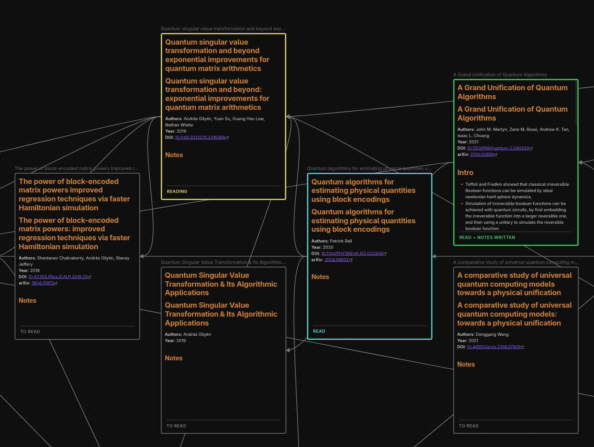
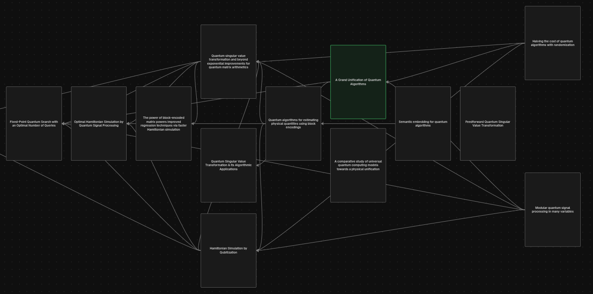
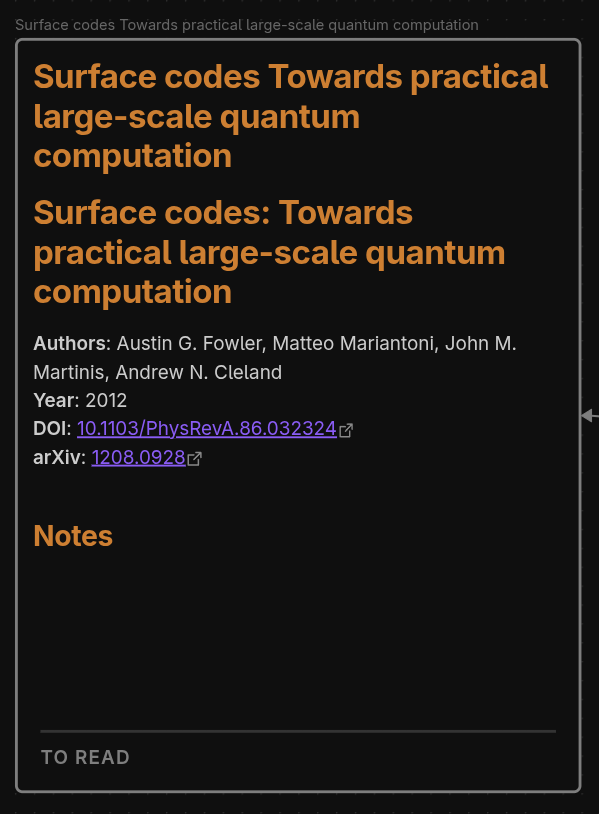
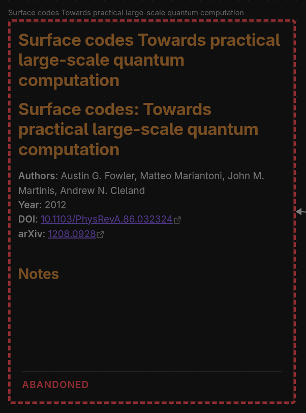

# Citation Graph

An Obsidian plugin that turns a Zotero collection into a **citation graph canvas**: papers as nodes, citations as edges, laid out on a timeline by year. From there you can expand the graph with references and citing works, track what you have read, download PDFs, and have an LLM summarise them, all without leaving your vault.



Six papers on a canvas. Each node is a literature note, its border colour is the reading status, and each arrow runs from a citing paper to the work it cites.

<!-- Demo video and GIF go here. -->

## Contents

- [What it does](#what-it-does)
- [Requirements](#requirements)
- [What this plugin sends, reads and costs](#what-this-plugin-sends-reads-and-costs)
- [Installation](#installation)
- [Quick start](#quick-start)
- [Commands](#commands)
- [How the features behave](#how-the-features-behave)
- [Settings](#settings)
- [Literature notes](#literature-notes)
- [How it works](#how-it-works)
- [Limitations](#limitations)
- [Development](#development)
- [Contributing](#contributing)
- [License](#license)

## What it does

**Build a canvas.** *Create from collection* pulls a Zotero collection; *Create from tag* pulls everything carrying one or more tags (several tags means an intersection, and importer-added tags are hidden unless you ask for them). Papers are resolved through Semantic Scholar, citation edges are drawn between any two papers both present, and each paper gets a literature note with structured frontmatter.



Zoomed out, the shape of the literature shows: papers are placed left to right by publication year, and an edge appears wherever one paper on the canvas cites another.

**Grow it.** *Expand paper* finds a paper's references and citing works, filtered by direction, keyword and year, and sorted by citation count. Pick what to add, and notes, nodes and edges appear (with the new papers optionally pushed to Zotero). The same run also links the expanded paper to papers already on the canvas that cite it or that it cites. *Resolve missing citation edges* does that for the whole canvas at once: it re-checks every paper and draws every edge the canvas does not yet have, without moving a single node. *Add paper by DOI or arXiv* adds one paper directly; if Semantic Scholar does not know it, the plugin falls back to OpenAlex, arXiv and Crossref so it still lands with whatever metadata exists.

**Prune it.** Any paper you are offered can be marked uninteresting instead of added, and it is then never offered on that canvas again.

**Read through it.** Every paper carries a reading status painted as its node colour, so a canvas doubles as a reading list: *to read*, *reading*, *read*, *read with notes written*, and *abandoned*. Set them one at a time, cycle them from a hotkey, or repaint a whole canvas at once.

**Fill it in.** *Download* fetches PDFs from arXiv. *Write summary* sends a PDF to Anthropic, OpenAI, Google Gemini, or a local Claude CLI and writes a structured summary into the note, with a progress bar and a token budget you can cap.

**Ask for more.** *Recommend papers* describes the whole canvas to the same LLM and asks what else belongs on it, searching the web where the provider supports it. Every suggestion is checked against a citation database before you see it, so invented papers never reach the picker, and the ones that survive are offered in the same checkbox list *Expand paper* uses.

**Keep it tidy.** *Sync canvas to Zotero* pushes new papers back. *Send papers to canvas* copies or moves papers with their edges between canvases. *Relayout canvas* re-sorts by year. *Delete paper* removes the node, its edges and the note together, which Obsidian's own delete does not.

## Requirements

- **Obsidian 1.7.2 or later**, on desktop. The plugin talks to local processes and the filesystem, so it does not run on mobile.
- **Zotero**, running, with the local API enabled: Edit, Settings, Advanced, then tick *"Allow other applications on this computer to communicate with Zotero"*.
- **Better BibTeX** (recommended) for the citekeys used in note filenames and matching.
- For *Write summary* and *Recommend papers*: an API key for Anthropic, OpenAI or Google Gemini, or the Claude CLI installed locally.
- For *Sync canvas to Zotero*: a Zotero API key and user ID from [zotero.org/settings/keys](https://www.zotero.org/settings/keys).

## What this plugin sends, reads and costs

Nothing here happens without you running a command, and nothing is collected about you: the plugin has no telemetry, no analytics and no server of its own.

**Remote services.** Each is contacted only by the command that needs it.

| Service | When | What is sent |
| --- | --- | --- |
| Zotero local API, `localhost:23119` | *Create from collection*, *Create from tag* | Nothing leaves your machine |
| `api.semanticscholar.org` | Resolving papers and their citation links | DOIs, arXiv IDs, paper titles |
| `api.openalex.org` | Papers Semantic Scholar cannot resolve; finding an arXiv preprint behind a publisher DOI | DOIs, and your contact email if you set one |
| `api.crossref.org` | Papers the above cannot resolve | DOIs, and your contact email if you set one |
| `export.arxiv.org`, `arxiv.org` | arXiv metadata, title search, PDF download | arXiv IDs, paper titles |
| `api.zotero.org` | *Sync canvas to Zotero* | Paper metadata, plus your Zotero API key |
| `api.anthropic.com`, `api.openai.com`, `generativelanguage.googleapis.com` | *Write summary*, *Recommend papers* | The paper's PDF, or the canvas's titles, authors, years and identifiers; abstracts only if you tick *Include abstracts* |

**Files outside your vault.** PDFs are not notes, so they are not kept in the vault. *Download* writes them to the folder you name, and *Write summary* reads them back from it to send to a model. The plugin touches no other path. It also writes its own log and reference cache inside its plugin folder, which lives in your vault's configuration directory.

**A local process.** If you choose the *Claude CLI* provider, *Write summary* and *Recommend papers* run the `claude` binary already installed on your machine, at the path you configure. Nothing is downloaded or installed for you, ever.

**Costs.** The plugin is free, and so is everything it needs to build a canvas. *Write summary* and *Recommend papers* are the exception: they call Anthropic, OpenAI or Google under your own account, and those providers bill you per call. Without a key there are no summaries and no recommendations; every other feature works without one.

## Installation

Not yet in the community marketplace, so install by hand:

1. Download `main.js`, `manifest.json` and `styles.css` from the [latest release](https://github.com/TheR4iner/obsidian-citation-graph/releases).
2. Put all three in `.obsidian/plugins/citation-graph/` inside your vault.
3. Enable **Citation Graph** under Settings, Community Plugins.

## Quick start

1. Start Zotero and confirm the local API is enabled (see [Requirements](#requirements)).
2. In Obsidian, run **Citation Graph: Canvas: create from collection** from the command palette and pick a collection. The plugin resolves each paper, writes a literature note, and opens a canvas under `collections/<collection name>/`.
3. Select a node and run **Expand paper** to pull in its references and citing works. Tick what you want; press *Add selected & ban rest* to discard the remainder for good.
4. After a few expansions, run **Canvas: resolve missing citation edges** to draw any arrows the canvas is still missing between papers it already holds.
5. Select a node and press your hotkey for **Cycle reading status** to move it through *to read*, *reading*, *read*. The node's border colour changes to match.

A first run over a large collection takes a few minutes, and a [Semantic Scholar API key](#rate-limits) removes most of that wait.

## Commands

All are in the command palette under `Citation Graph:`, grouped by a second prefix so that typing the group narrows the list: **Canvas**, **Papers**, **Reading**, **PDFs**, **Maintenance**. The rest of this page refers to each command by its short name.

Only three of them work without a canvas open: *Create from collection*, *Create from tag* and *Clear Semantic Scholar cache*. The other fifteen are hidden from the palette until a canvas is open, so the list stays short while you are reading a note.

| Command | What it does |
|---|---|
| **Canvas: create from collection** | Builds a canvas from a Zotero collection, into `<collections folder>/<collection name>/` |
| **Canvas: create from tag** | Builds a canvas from an intersection of Zotero tags, into a folder named after the tags |
| **Canvas: relayout** | Re-sorts nodes chronologically, discarding manual positions |
| **Canvas: resolve missing citation edges** | Re-checks every paper on the canvas and draws the edges it is missing; **(force refresh)** bypasses the local cache |
| **Canvas: sync to Zotero** | Pushes the canvas's papers back to a Zotero collection |
| **Canvas: send papers to another canvas** | Copies or moves papers, with their edges, to another canvas |
| **Papers: expand paper** | Adds a paper's references and citing works; **(force refresh)** bypasses the local cache |
| **Papers: add by DOI or arXiv** | Adds one paper from a DOI, an arXiv ID, or a URL containing either |
| **Papers: recommend papers** | Asks the LLM which papers would fit this canvas, verifies them, and adds the ones you pick |
| **Papers: delete paper** | Deletes the node, its edges and the literature note together |
| **Reading: set paper status** | Sets the selected papers to *to read*, *reading*, *read*, or *abandoned* |
| **Reading: cycle reading status** | Advances the selection one step through *to read*, *reading*, *read*. Good on a hotkey |
| **Reading: refresh reading status** | Repaints every paper on the canvas from its note |
| **PDFs: download** | Fetches PDFs for papers on the canvas |
| **PDFs: write summary** | Writes an LLM summary into the note under `## Summary` |
| **Maintenance: clear Semantic Scholar cache** | Drops cached reference data if you suspect it is stale |

Commands that act on papers take the current canvas selection, and fall back to a fuzzy picker when nothing is selected. Renaming a command does not change its ID, so any hotkey you had assigned still works; a hotkey for a canvas command does nothing while no canvas is open, and every command stays listed under Settings, Hotkeys either way.

### On the canvas

Right-clicking a paper node offers the per-paper commands directly: *Expand paper*, *Set paper status*, *Cycle reading status*, *Download*, *Write summary* and *Delete paper*. Right-clicking with several nodes selected offers the same entries minus *Expand paper*, which acts on one paper at a time, and each entry names how many papers it will touch. Nodes that are not literature notes get no entries. Every command remains in the palette regardless.

## How the features behave

### Reading status

<table>
<tr>
<td align="center"></td>
<td align="center"></td>
<td align="center"></td>
<td align="center"></td>
</tr>
<tr>
<td align="center"><b>To read</b></td>
<td align="center"><b>Reading</b></td>
<td align="center"><b>Read</b></td>
<td align="center"><b>Abandoned</b></td>
</tr>
</table>

The same paper in four of the five states, at the default colours. The fifth, *Read + notes written*, is green and appears as soon as the note has content of its own.

**Status lives in the note**, in a `status` frontmatter field, so it follows a paper across every canvas it appears on and is queryable from Dataview. Notes predating this feature carry `read: true` and are treated as *read* until their status is next set.

**"Read with notes written" is derived, not stored.** As soon as a note contains anything beyond the generated template, whether your own prose, an added heading, a checklist, or a summary from *Write summary*, the paper is painted as annotated. It is therefore absent from the status picker, and it is why *Refresh reading status* exists: writing notes changes a paper's appearance with no command involved. Abandoned papers are the exception and stay abandoned, since notes on them usually record why you dropped the paper.

### Reading an abstract in the picker

Each picker row shows the first 200 characters of the paper's abstract, followed by a **Show more** link when there is more to read. It unfolds the full abstract in place, and **Show less** folds it back. Unfolded abstracts stay open while you search, filter by year or ban a row, so deciding on a paper never means closing the dialog.

### Marking papers uninteresting

Every row in the *Expand paper* and *Recommend papers* pickers carries a small cross button that marks that paper uninteresting rather than adding it. **Add selected & ban rest** does the same in bulk: it adds what you ticked and marks everything else in the list. Banned papers are filtered out of every later picker for that canvas, so a paper you have already rejected does not keep reappearing each time you expand a neighbour.

The list lives in the canvas file, so it travels with the canvas. Review it, or put a paper back in circulation, under Settings, [Banned papers](#banned-papers).

### Write summary

**Write summary finds the PDF** by looking for `Title (Author) (Year).pdf` in the canvas's last download directory and then in the default download path, and offers to download it if it is missing, arXiv lookup included. It warns before summarising anything over ten pages, and asks whether to append or replace when a `## Summary` section already exists. It runs only when you ask for it: adding a paper to a canvas never starts a summary on its own.

### Download

**Download** saves as `Title (FirstAuthor) (Year).pdf`. With exactly one paper selected and a download folder already known (the canvas's last one, or the *Default download path* setting), it downloads straight away; otherwise it opens a picker where you choose the papers and the folder. Papers already in the target directory are marked `downloaded` and left unchecked.

**arXiv is always checked before a paper is called unavailable.** A paper added by the DOI of its published version usually has no arXiv ID recorded, because Semantic Scholar files the preprint and the journal article as two unrelated records; the preprint is on arXiv all the same. Such a paper is marked `no ID yet` and left unticked, so a large canvas does not open with dozens of lookups queued, but it stays selectable. Selecting it makes the download run look the paper up: first through the arXiv-minted DOI, then through OpenAlex's record of where the DOI is hosted, then by searching arXiv for the exact title. Any ID found is written into the note's frontmatter, so the next run needs no lookup.

Only arXiv ships configured, so a paper with no arXiv version cannot be fetched. Adding a source is a code change: see [Adding a PDF download source](#adding-a-pdf-download-source).

### Recommend papers

**Recommend papers** sends every paper's title, authors, year and identifiers, and nothing else, unless you tick *Include abstracts* in the prompt box. Abstracts cost roughly 250 extra input tokens per paper and, on a large canvas, tend to crowd out the titles, so leave them off unless a run has been giving vague suggestions. The prompt box overrides the *Recommendation prompt* setting for one run; the canvas listing and the required JSON reply format are appended by the plugin either way, so a custom prompt cannot break parsing. Suggestions that no citation source can find are discarded, as are ones whose DOI turns out to belong to a different paper: the count of each is reported, and the titles go to `citation-graph.log`.

**A recommendation run takes minutes, and says so while it works.** The notice carries a running clock, so a long wait is visibly a wait rather than a hang. With the Claude CLI it also names what the model is doing as it happens, reading its event stream: thinking, searching the web for a given query, or writing the answer. The API providers are reached through Obsidian's `requestUrl`, which returns a response whole and cannot stream, so there the clock is all there is.

### Resolving citation edges

**Resolve missing citation edges** walks every paper on the canvas, asks the citation sources for its references and citing works, and draws each edge whose two endpoints are both already on the canvas. Nodes are never moved: only the edge list is rewritten, so hand-placed positions survive. It is the canvas-wide version of what *Expand paper* does for one paper, and the way to fill in edges a canvas is missing, because *Expand paper* cannot reach a pair of papers that arrived by separate routes: it lists an already-present paper with its row disabled.

Reach for it after a stretch of adding papers one at a time, after *Send papers to canvas*, or when two papers you know are connected sit side by side with no arrow between them. It is safe to re-run: an edge already drawn is left alone.

Cached reference data is reused, so a second run over the same canvas is nearly instant. **(force refresh)** ignores the cache and re-queries every paper, which is what to use when the cached answer looks wrong or predates a paper you expect to be cited by. A full refresh is one round of requests per paper, so on a large canvas it is slow without a Semantic Scholar API key. See [Rate limits](#rate-limits).

The closing notice reports how many edges were added, how many papers came from the cache, how many returned no citation data at all, and how many carry no DOI, arXiv ID or Semantic Scholar ID to look up. The titles behind the last two counts go to `citation-graph.log`.

### Rate limits

**Semantic Scholar rate limits are retried, not swallowed.** Verification is one request per suggestion against a service that allows roughly 100 every 5 minutes without an API key, so ten suggestions take about half a minute and can be throttled anyway. A refused request is retried after 5, 15 and 45 seconds, and the notice says so while it waits. If it is still refused, verification stops and reports the remaining suggestions as *never checked* rather than discarding them as nonexistent. An API key raises the ceiling and cuts the spacing between requests from 3 seconds to 1, and takes effect as soon as you enter it.

### Send papers to canvas

**Send papers to canvas** carries an edge over whenever both its endpoints exist on the target. It does not go looking for new ones: run *Resolve missing citation edges* on the target for that.

## Settings

The settings tab presents these in the order below. Only **Collections folder** sits above the first heading; every other section name here is a heading in the tab.

### General

| Setting | Description | Default |
|---|---|---|
| **Collections folder** | Root folder for canvases. Each canvas gets a subdirectory holding the canvas and its literature notes. Leave empty to use the vault root | `collections` |

### Zotero

| Setting | Description | Default |
|---|---|---|
| **Zotero API key** | Needed only for *Sync canvas to Zotero* | |
| **Zotero user ID** | Numeric ID shown at zotero.org, Settings, Security, Applications | |

Reading a collection needs neither: that goes through Zotero's local API, which is unauthenticated.

### Semantic Scholar

| Setting | Description | Default |
|---|---|---|
| **API key (optional)** | Raises the rate limit and cuts the spacing between requests from 3 seconds to 1. See [Rate limits](#rate-limits) | |
| **Reference cache** | Shows how many papers are cached, with a button to clear them. Same effect as *Clear Semantic Scholar cache* | |

### Supplementary citation sources

Queried alongside Semantic Scholar so a paper it does not know, or references it has not indexed, still turn up.

| Setting | Description | Default |
|---|---|---|
| **OpenAlex** | Query OpenAlex for metadata and citations | On |
| **CrossRef** | Query Crossref for publisher metadata; references only, and only where the publisher deposited them | On |
| **Email for polite access** | Sent to OpenAlex and Crossref, which grant better rate limits to identified callers. Recommended | |

### Canvas

| Setting | Description | Default |
|---|---|---|
| **Node width** | Canvas node width in pixels | 600 |
| **Node height** | Canvas node height in pixels | 800 |

### Reading status colours

| Setting | Description | Default |
|---|---|---|
| **To read** | Node colour for papers not started | No colour |
| **Reading** | Node colour for papers in progress | Yellow |
| **Read** | Node colour for papers finished but not written up | Cyan |
| **Read + notes written** | Node colour applied automatically once the note has content of its own | Green |
| **Abandoned** | Node colour for papers you decided not to finish; also dimmed with a dashed border | Red |

See [How status colours are drawn](#how-status-colours-are-drawn) below.

### Summaries

| Setting | Description | Default |
|---|---|---|
| **Provider** | Anthropic API, OpenAI API, Google Gemini API, or the local Claude CLI | Claude CLI |
| **Claude CLI path** | Claude CLI only. Blank auto-detects `~/.local/bin/claude`, then `claude` on Obsidian's PATH | |
| **API key** | For the selected provider; not needed for Claude CLI | |
| **Model** | Overrides the provider default (`claude-sonnet-5`, `gpt-4o`, `gemini-2.5-flash`) | |
| **Max output tokens** | Cap per summary, controlling length and cost | 1024 |
| **Batch token budget** | Stops a batch once this many tokens are spent; 0 is unlimited. Not tracked for Claude CLI | 0 |
| **Summary prompt** | Replaces the built-in prompt. Supports `{title}`, `{authors}`, `{year}`; the PDF is attached automatically | |

The provider chosen here is also the one *Recommend papers* uses.

### Recommendations

| Setting | Description | Default |
|---|---|---|
| **Papers to suggest** | How many papers *Recommend papers* asks for per run | 10 |
| **Search the web** | Lets the model search while recommending. Supported by the Anthropic API, Gemini and the Claude CLI; the OpenAI endpoint used here has no search tool | On |
| **Max output tokens** | Cap per recommendation reply. A truncated reply cannot be read back, so this is higher than the summary cap | 4096 |
| **Recommendation prompt** | Standing instructions for *Recommend papers*. The command's own prompt box overrides it for a single run | |

### Download

| Setting | Description | Default |
|---|---|---|
| **Default download path** | Where PDFs are saved. Absolute, or starting with `~` | |

### Banned papers

| Setting | Description | Default |
|---|---|---|
| **Manage banned papers** | Opens a per-canvas list of the papers you marked uninteresting, searchable, with a button to take one off the list so it is offered again | |

### How status colours are drawn

The colour is applied to the node's **border only**, a 3px frame at full strength with Obsidian's tinted interior removed, and the status is spelled out along the bottom edge in the same colour (pictured under [Reading status](#reading-status)). Obsidian's default treatment (a 1px border at 40% opacity plus a 7% wash) is too weak to separate similar colours and tints the note's text for no benefit; at full strength on the border alone, the closest pair of statuses is roughly three times easier to tell apart.

The label is derived from the node's colour rather than stored alongside it, which keeps the `.canvas` file the single source of truth. One consequence: **two statuses sharing a colour cannot be told apart**, and the settings tab warns you when that happens.

Each colour is one of Obsidian's six presets, *No colour*, or a custom `#rrggbb` value. Presets follow your theme's `--color-*` variables; a hex value is fixed and will not adapt between light and dark mode, which is the trade-off for matching a theme that does not define those variables.

Notes on a canvas that are not papers are left alone entirely: they keep your colour, get no label, and the status commands skip them. A note counts as a paper when its frontmatter carries any of `doi`, `arxiv`, `citekey` or `semantic_scholar_id`.

## Literature notes

```yaml
---
title: "Attention Is All You Need"
authors: ["Ashish Vaswani", "Noam Shazeer", "Niki Parmar"]
year: 2017
doi: "10.48550/arXiv.1706.03762"
arxiv: "1706.03762"
citekey: "vaswani2017attention"
semantic_scholar_id: "204e3073870fae3d05bcbc2f6a8e263d9b72e776"
status: unread
cssclasses:
  - citation-graph-note
---
```

The body carries a title heading, an author/year/DOI/arXiv block, a `## Summary` section written by *Write summary*, and a `## Notes` section for you.

`status` holds one of `unread`, `reading`, `read` or `abandoned`, which the interface labels *To read*, *Reading*, *Read* and *Abandoned*. *Read + notes written* has no stored value: it is derived from the note's body.

## How it works

The **Zotero local API** on `localhost:23119` reads collections and items, needing no authentication. **Semantic Scholar** resolves papers by DOI or arXiv ID and supplies citation relationships; **OpenAlex**, **arXiv** and **Crossref** cover papers it does not know. The **Zotero Web API** writes papers back and needs your API key. For summaries, Anthropic and Google take the PDF natively while OpenAI receives it as a file attachment.

## Limitations

- Papers with neither a DOI nor an arXiv ID cannot be resolved, and are skipped.
- Citation edges are drawn only between papers both present on the canvas.
- *Expand paper* and *Add paper by DOI or arXiv* resolve only the edges incident to the paper they act on. An edge between two *other* papers on the canvas needs *Resolve missing citation edges*. See [Resolving citation edges](#resolving-citation-edges).
- A first run over a large collection takes minutes without a Semantic Scholar API key. See [Rate limits](#rate-limits).
- Only arXiv is configured as a PDF source, so *Download* and *Write summary* cannot reach a paper that has no arXiv version. See [Download](#download).
- Finding the arXiv preprint behind a publisher DOI costs a rate-limited request or two per paper, so a batch of papers with no recorded arXiv ID takes noticeably longer than one where the IDs are known.
- *Recommend papers* drops any suggestion no citation source can identify, so a genuinely obscure paper the model knows about may still be lost.
- Live progress during a recommendation run needs the Claude CLI; the API providers report elapsed time alone.

## Development

```bash
git clone https://github.com/TheR4iner/obsidian-citation-graph.git
cd obsidian-citation-graph
npm install
npm run build      # type-check, test, bundle
npm run dev        # rebuild on change
npm test           # tests alone
npm run test:watch
```

Copy `main.js`, `manifest.json` and `styles.css` into `.obsidian/plugins/citation-graph/` to try a build in your vault.

Tests run under [vitest](https://vitest.dev) over the plugin's pure logic: reading-status parsing and derivation, canvas colour validation, note-body inspection, canvas node IDs, summary placement, the download path's source selection and failure reporting, LLM request building, recommendation parsing and verification, and progress-notice formatting. `npm run build` runs them before bundling, so a failing test blocks a release. `obsidian` is a types-only dependency, so `vitest.config.mts` aliases it to a stub in `test/` at runtime while type-checking still uses the real declarations.

`npm install` also points `core.hooksPath` at `.githooks/`. Those hooks do nothing in a plain checkout; see `.githooks/README.md`.

### Adding a PDF download source

The download path is written against the `DownloadFallback` interface in `src/api/download-fallback.ts`. A build ships at most one fallback, returned by `getDownloadFallback()` in `src/api/fallback-source.ts`, which returns `null` here. Implement the interface in its own module and return an instance from that function: the picker's row gating, progress reporting and error messages pick it up with no other changes.

## Contributing

Bug reports, feature ideas and pull requests are all welcome. See [CONTRIBUTING.md](CONTRIBUTING.md) for how the branches work, what the checks run, and what a change is expected to bring with it.

## License

MIT
